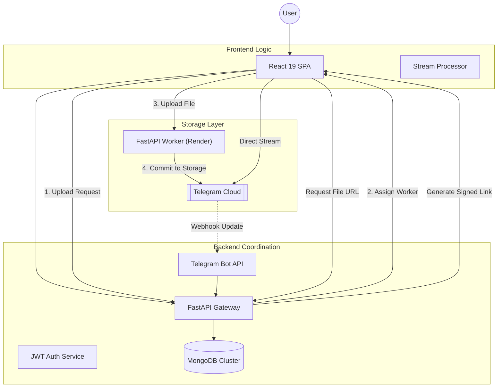

# TDrive - Unlimited Cloud Storage Architecture

**Project Goal**: To engineer a zero-cost, unlimited cloud storage solution by reverse-engineering the Telegram MTProto API, effectively turning a messaging platform into a high-performance distributed object storage system.
## NOTE: The original repository is private. This repository is for recruiters who wish to see the live website. If you'd like to view the source code, please contact me.
---

## 💡 The Engineering Challenge

Standard cloud storage (S3, GCS) becomes prohibitively expensive at scale. The challenge was to build a system that offers **unlimited storage** without the associated costs, while maintaining the user experience of Google Drive.

**Key Constraints & Solutions:**
- **Constraint**: Telegram has file size limits and API rate limits.
- **Solution**: Implemented a **dedicated worker architecture** that processes file transfers through a single worker instance to strictly adhere to API rate limits and maintain connection stability.
- **Constraint**: Serving large files through a backend server consumes massive bandwidth.
- **Solution**: Developed a **direct-streaming mechanism** where the frontend streams media directly from Telegram's CDN nodes, completely bypassing the backend server for data transfer.

---

## 🏗️ System Architecture

The system uses a **decoupled metadata architecture**. The "filesystem" structure exists only in MongoDB, while the actual data blobs are distributed across Telegram's global CDN.

### Key Design Decisions

#### 1. Dedicated FastAPI Worker
The system utilizes a **dedicated FastAPI worker** deployed on Render to handle the complexities of the MTProto protocol.
- **Session Stability**: Maintains persistent connections to Telegram's datacenters, avoiding the overhead of frequent re-authentication.
- **Traffic Regulation**: Centralizes API calls to strictly adhere to Telegram's rate limits and prevent account flagging.

#### 2. Hybrid Thumbnail Generation
To handle media previews efficiently without a GPU-heavy backend, the system offloads processing to the edge.
- **Client-Side Generation**: Thumbnails are created directly in the browser, ensuring immediate previews without server-side overhead.
- **Multi-Target Storage**: Supports persisting thumbnails to Telegram's infrastructure or external CDNs like Cloudinary or ImgBB for high-performance caching.

#### 3. Virtual File System (VFS)
The file system is a **Directed Acyclic Graph (DAG)** stored in MongoDB.
- Allows for instant "moves" and "renames" (O(1) complexity) by updating parent pointers rather than moving data.
- Supports **Shared Albums** and collaborative folders without duplicating underlying data blobs.

---

## 🚀 Technical Highlights & Solved Problems

### ⚡ Bandwidth Optimization
**Problem**: Streaming large files (up to 4GB) through a standard VPS would exceed bandwidth limits and cause memory overflows.
**Solution**: Implemented a **hybrid chunked streaming** strategy. Files under 20MB are fetched via the Telegram Bot API for low-latency access. Larger files are served through a dedicated worker that streams data in manageable chunks, preventing high load on both the worker and Telegram's infrastructure. This approach ensures the system remains compatible with the free-tier resource limits of hosting platforms.

### 🔄 State Synchronization
**Problem**: Start-up latency when syncing thousands of files.
**Solution**: Implemented an **Optimistic UI** with a background reconciliation queue. The UI updates instantly, while a background worker syncs the state with Telegram. If a drift is detected (e.g., file deleted on Telegram), the system self-heals by reconciling the MongoDB state.

### 🛡️ Security & Privacy
- **Isolation**: Each user's data is stored in a private, dedicated Telegram channel created programmatically.
- **Encryption**: File metadata and folder structure are essentially encrypted by obscurity; without the MongoDB mapping, the raw data in Telegram is just an unstructured stream of random files.

---

## 🛠️ Technology Stack Breakdown

| Layer | Technology | Role |
|-------|------------|------|
| **Core Service** | **FastAPI (Python)** | High-performance async API handling parallel requests. |
| **Data Layer** | **MongoDB & Motor** | Async document storage for flexible schema evolution. |
| **Client** | **React 19 + TypeScript** | Type-safe, component-based UI with optimistic state management. |
| **Styling** | **Tailwind CSS + Shadcn** | Modern, accessible, and responsive design system. |
| **Protocol** | **MTProto** | Direct interaction with Telegram's binary protocol for maximum speed. |

---

## 🔮 Future Scalability
- **Sharding**: User data is already logically isolated by channel, making database sharding trivial for future scale.
- **Edge Caching**: Investigating the use of Service Workers to cache frequently accessed file chunks locally for offline access.
